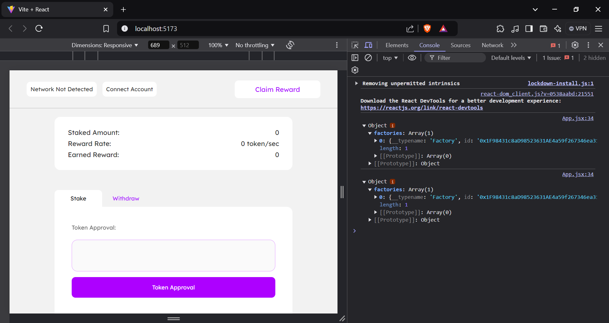
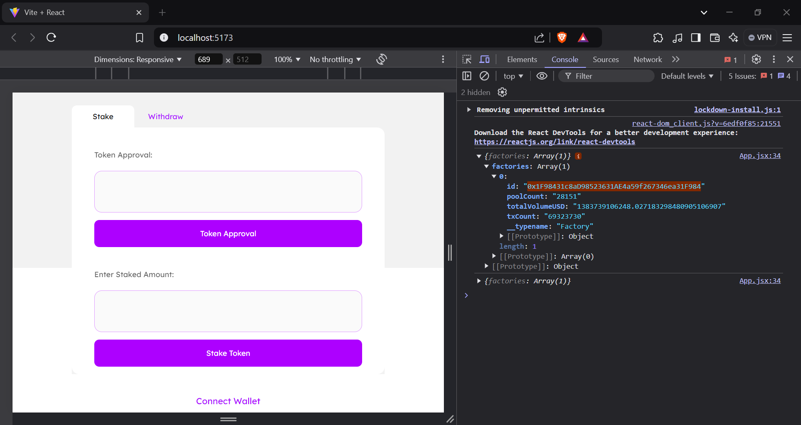
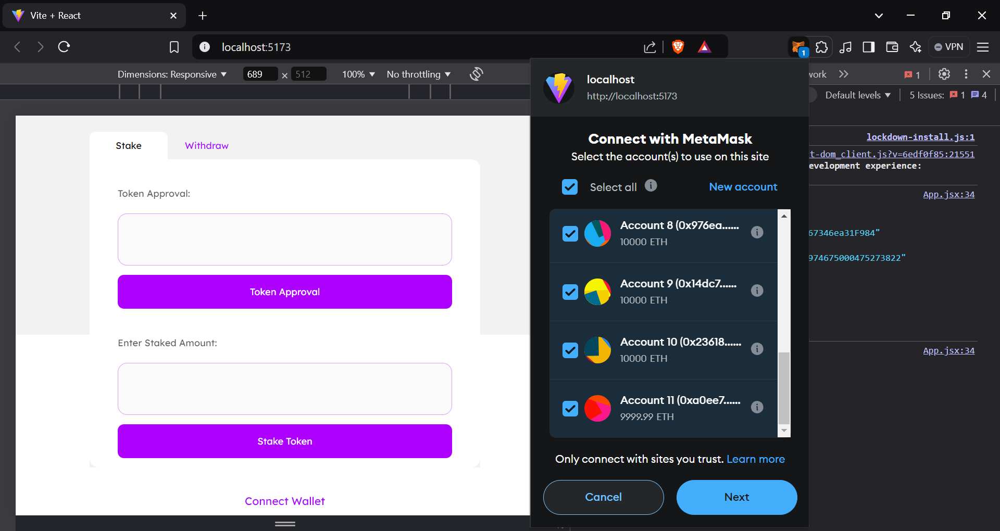

# Web3 Portfolio Manager

## Overview

The Web3 Portfolio Manager is a decentralized application (dApp) designed to help users monitor, manage, and analyze their DeFi assets across various protocols. By leveraging The Graph Protocol, this application provides real-time data updates, portfolio insights, and a user-friendly interface for managing assets.

[SubGraph Description](https://thegraph.com/studio/subgraph/ethos_teamh14_round2_subgraph/)


## Features

- **Portfolio Overview Dashboard**: Displays assets across different DeFi protocols, including token balances, staking positions, and liquidity pool shares.
- **Real-Time Data Updates**: Reflects changes in user portfolios with real-time data, such as token price changes and staking rewards.
- **Custom Subgraph Integration**: Allows users to deploy custom subgraphs for unique data needs or utilize existing ones for streamlined development.
- **Data Visualization**: Provides charts, graphs, and tables to visualize trends like token prices, historical yields, and liquidity positions.
- **User  Authentication**: Integrates wallet authentication (e.g., WalletConnect or MetaMask) to securely connect users’ wallets and retrieve their data.
- **Analytics & Insights**: Offers insights such as portfolio risk assessments, yield optimization suggestions, and historical performance analysis.
- **Cross-Chain Data Aggregation**: Integrates data across multiple blockchains for a comprehensive portfolio view.

## Current Implementation

As of now, our team has successfully integrated The Graph Protocol into our Staking DApp. This integration allows us to efficiently index and query data related to staking activities, enhancing the overall functionality of the application.



### Key Features of the Current Implementation

- **Event Indexing**: The Graph Protocol is used to index key events from our smart contracts, including staking, unstaking, and reward claiming. This ensures that all relevant data is readily available for querying.

- **Real-Time Data Updates**: By leveraging The Graph's event-driven architecture, our DApp can provide users with real-time updates on their staking positions and rewards, ensuring they have the most current information at their fingertips.

- **Custom Subgraph**: We have deployed a custom subgraph tailored to our staking logic, which allows us to efficiently retrieve data specific to our staking contract. This includes tracking user stakes, total rewards, and other relevant metrics.

- **User -Friendly Queries**: The integration simplifies the process of querying data, allowing us to present users with a clear overview of their staking activities and rewards through our dashboard.

### Future Enhancements

While the current implementation focuses on staking, we plan to expand the use of The Graph Protocol to include additional DeFi protocols, such as Uniswap and Aave, to provide a more comprehensive portfolio management experience. This will enable users to monitor and manage their assets across multiple platforms seamlessly.

## Using The Graph Protocol

The Graph Protocol is a decentralized indexing protocol that allows developers to efficiently query blockchain data. In this project, The Graph is utilized to:

1. **Index Data from Multiple Protocols**: By using existing subgraphs for protocols like Uniswap and Aave, the application can retrieve data on token balances, staking positions, and liquidity pool shares without running a full node.

2. **Real-Time Data Updates**: The Graph's event-driven architecture allows the application to receive real-time updates on asset prices, staking rewards, and other relevant data, ensuring that users have the most current information.

3. **Custom Subgraph Deployment**: For unique data needs, users can deploy custom subgraphs that index specific events and entities relevant to their portfolios, enabling tailored data retrieval.

4. **Data Aggregation**: The Graph allows for the aggregation of data from multiple sources, making it easier to present a comprehensive view of a user's portfolio across different DeFi protocols.






## Architecture

The architecture of the Web3 Portfolio Manager consists of the following components:

- **Frontend**: A user-friendly interface built with React.js that allows users to interact with their portfolios, view analytics, and visualize data.
- **Backend**: A server that handles wallet authentication, data retrieval from The Graph, and any necessary business logic.
- **Subgraphs**: Existing and custom subgraphs deployed on The Graph to index relevant data from various DeFi protocols.

### Data Flow

1. **User  Authentication**: Users connect their wallets using WalletConnect or MetaMask.
2. **Data Retrieval**: The application queries The Graph for user-specific data, including token balances, staking positions, and liquidity pool shares.
3. **Data Visualization**: Retrieved data is processed and displayed in charts, graphs, and tables on the dashboard.
4. **Real-Time Updates**: The application listens for events from The Graph to update the portfolio in real-time.

## Getting Started

To run the application locally, follow these steps:

1. Clone the repository:
   ```bash
   git clone https://github.com/Prabhatmishra7131/Ethos_TeamH14_TheGraphProtocol_Round2_Submission.git
   cd client
   npm run dev
2. If you want to Create your Own Subraph:
   You can install Graph CLI with either npm or yarn.
   ```bash
   npm install -g @graphprotocol/graph-cli
   yarn global add @graphprotocol/graph-cli
3. Initialising The Graph:
   ```bash
   graph init --studio
   Your_Subgraph_project_name
4. Auth & Deploy:
   ```bash
   graph auth --studio 
   Your_API_Key
5. Entering, Building & Deploying Subgraph:
   ```bash
   cd Your_Subgraph_project_name
   graph codegen && graph build
   graph deploy --studio
   Your_Subgraph_project_name
